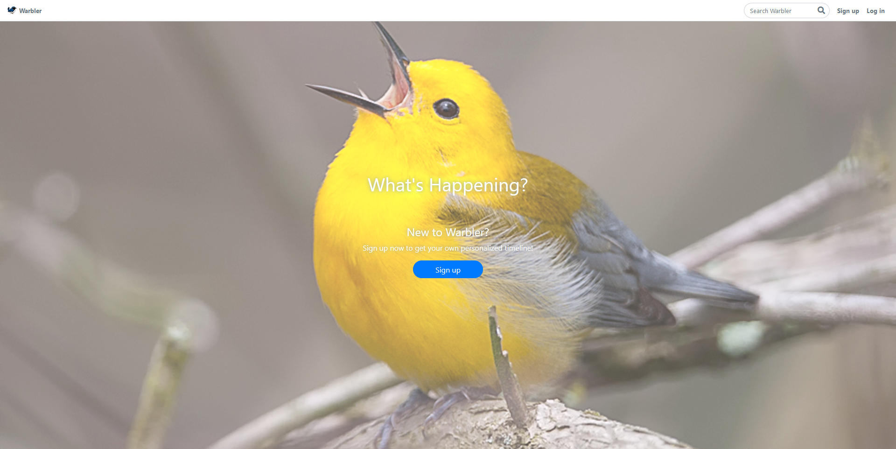

# Warbler



A small and simple twitter clone built with the use of Flask web framework. It mimics the basic Twitter website functions such as basic authentication, following other users, posting own message, and "liking" messages of other users.

## Demo

**Live demo can be accessed at:** [https://thawing-spire-34431.herokuapp.com/
](https://thawing-spire-34431.herokuapp.com/)

<br>


### Built with:

- Flask
- PostgreSQL
- Bootstrap 4

## Installation

In order to start this app on your local machine, you will need to set up a Python virtual environment, create a Postgres database (either provide a .env file with included database URI or manually insert DB URI in `app.py`), populate the database with provided mock data (optional) and run the server from the console

```
    > git clone https://github.com/PZDuck/twitter-clone.git
    > python -m venv .venv
    > pip install -r requirements.txt
    > source .venv/bin/activate
    > python seed.py (optional)
    > flask run
```

## Requirements

- Flask
  - Flask-Bcrypt 0.7.1
  - Flask-SQLAlchemy 2.4.3
  - Flask-WTF 0.14.3
- SQLAlchemy 1.3.18
- WTForms 2.3.1
